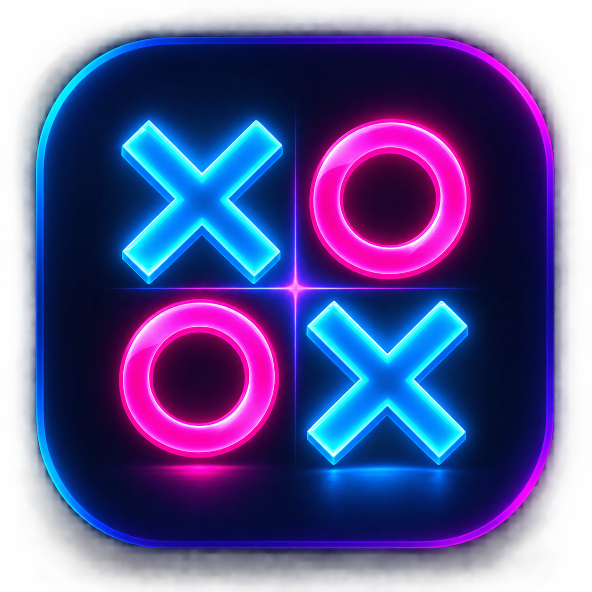

# 🎮 Tic Tac Duel

> A futuristic neon Tic Tac Toe multiplayer game.

<!--  -->

## 📱 App Icon

<p align="center">
  
</p>
## ℹ️ Project Info

Tic Tac Duel is a futuristic neon-themed Tic Tac Toe game focused on a clean, competitive multiplayer experience with real-time gameplay.

## 🛠️ Tech Stack

* **Frontend:** Flutter
* **Backend:** Node.js
* **Real-time:** WebSockets

## ✨ Features

* 🎮 Real-time multiplayer Tic Tac Toe
* ⚡ WebSocket-powered gameplay
* 🌌 Futuristic neon UI
* 👥 Create and join game rooms
* 🔄 Real-time game state synchronization
* 📱 Cross-platform Flutter frontend

## 📂 Project Structure

```text
TicTac-Duel/
├── frontend/    # Flutter application
└── backend/     # Node.js WebSocket server
```

## 🚀 Getting Started

### Frontend

```bash
cd frontend
flutter pub get
flutter run
```

### Backend

```bash
cd backend
npm install
npm run dev
```
