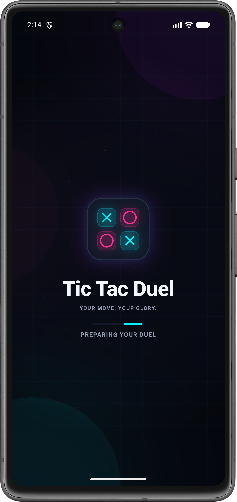
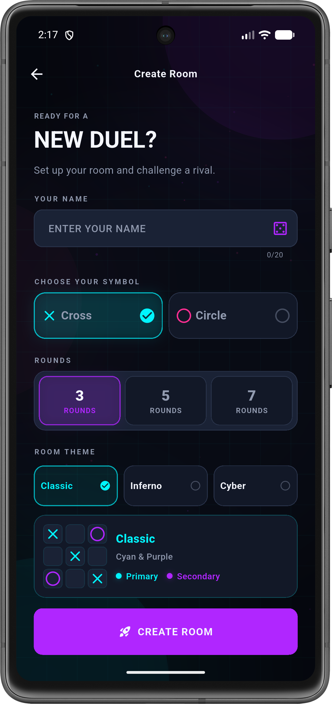
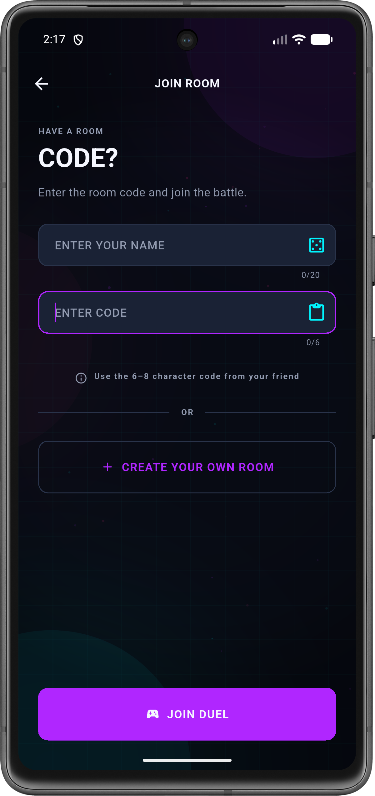
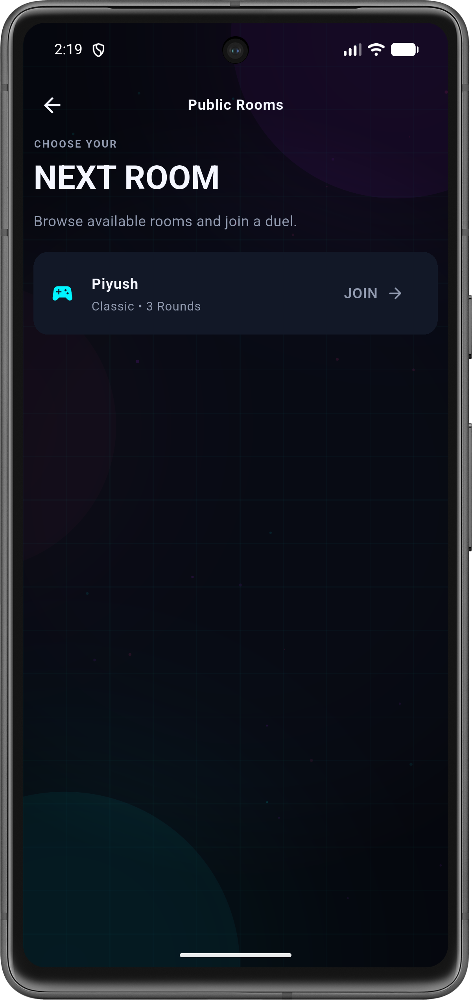
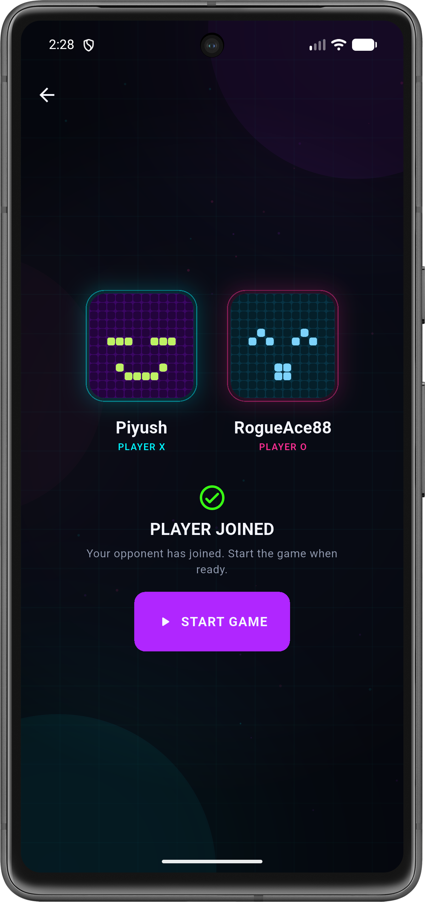
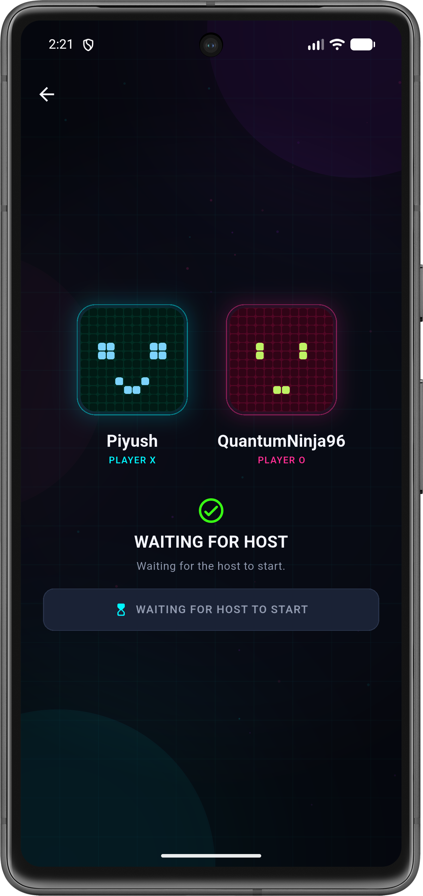
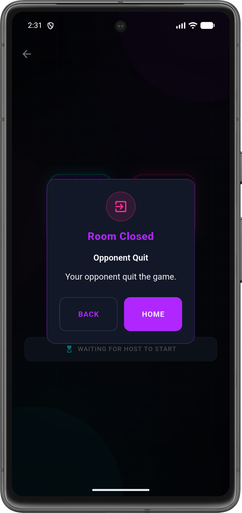
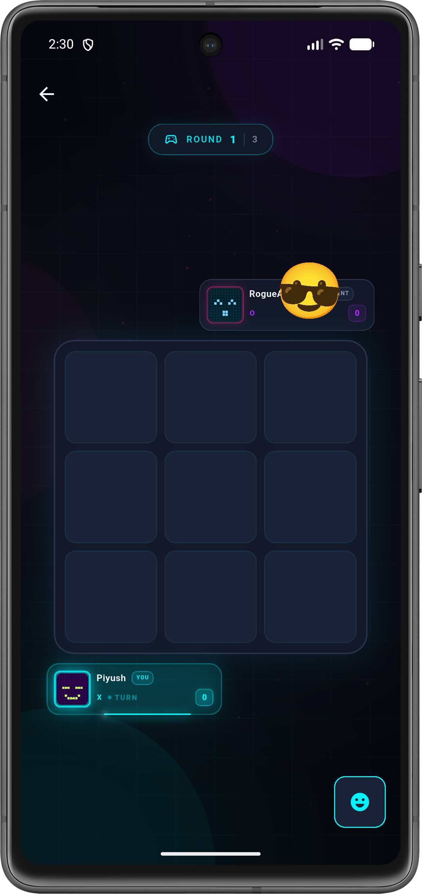
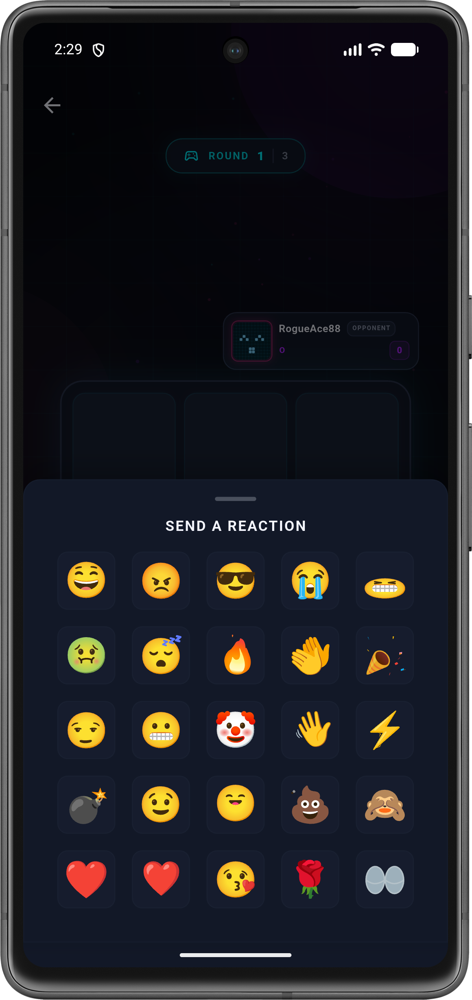

# 🎮 Tic Tac Duel

**YOUR MOVE. YOUR GLORY.**

A futuristic neon Tic Tac Toe game built with Flutter, featuring local multiplayer, CPU battles, and
real-time online gameplay.

<div align="center">


**🌐 [Play Tic Tac Duel — Live Dev Demo](https://tictacduel.vercel.app)**

</div>

## ✨ Features

- 👥 **Local Multiplayer** — Play with a friend on the same device.
- 🤖 **CPU Battles** — Challenge the computer with multiple difficulty levels.
- 🌐 **Online Multiplayer** — Create or join rooms and play in real time.
- 🔗 **Room Sharing** — Share room links to invite other players.
- 📱 **App Links** — Open supported shared links directly in the app.
- 🏆 **Multi-Round Matches** — Track scores across multiple rounds.
- 🎨 **Neon Themes** — Classic, Inferno, and Cyber.
- 🎵 **Audio & Effects** — Background music and sound effects powered by flutter_soloud, alongside animations, particles, and confetti.
- 💬 **Game Reactions** — Interact with your opponent during online matches.

## 🖼️ Screenshots

<div align="center">

















</div>

## 🛠️ Built With

- [Flutter](https://flutter.dev/) & Dart
- [Riverpod](https://riverpod.dev/) for state management
- [Socket.IO](https://socket.io/) for real-time multiplayer
- [Flutter Secure Storage](https://pub.dev/packages/flutter_secure_storage) for secure local storage
- [flutter_soloud](https://pub.dev/packages/flutter_soloud) for audio playback
- [Lottie](https://pub.dev/packages/lottie) for animations
- [Flutter Confetti](https://pub.dev/packages/flutter_confetti) for confetti effects

## 🚀 Getting Started

**Prerequisites:** Flutter SDK and a configured development environment.

```bash
git clone https://github.com/piro-piyush/TicTac-Duel.git
cd TicTac-Duel
flutter pub get
```

Create a `.env` file in the project root:

```env
BASE_URL=YOUR_BASE_URL
```

Replace `YOUR_BASE_URL` with your backend URL, then run:

```bash
flutter run
```

Check the project before submitting changes:

```bash
flutter analyze
flutter test
```

## 📦 Release — v2.0.0

Version **2.0.0** brings online multiplayer alongside local and CPU gameplay, with room sharing, app
link handling, animations, and enhanced game interactions.

**Downloads:** [Tic Tac Duel v2.0.0 — GitHub Release](https://github.com/piro-piyush/TicTac-Duel/releases/tag/v2.0.0)

| File                          | Intended use                            |
|-------------------------------|-----------------------------------------|
| `app-arm64-v8a-release.apk`   | Most modern Android phones              |
| `app-armeabi-v7a-release.apk` | Compatible 32-bit ARM devices           |
| `app-x86_64-release.apk`      | Compatible x86-64 devices and emulators |
| `app-release.aab`             | Google Play distribution                |

For most modern Android phones, choose `app-arm64-v8a-release.apk`.

## 👨‍💻 Developer

**Piyush Vishwakarma**

If you like Tic Tac Duel, consider giving the repository a ⭐
on [GitHub](https://github.com/piro-piyush/TicTac-Duel).

---

**Tic Tac Duel — YOUR MOVE. YOUR GLORY.**