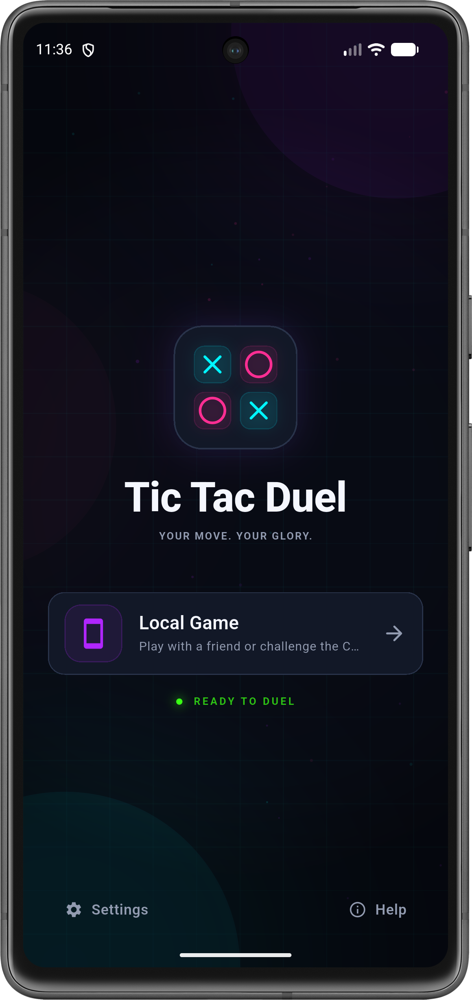
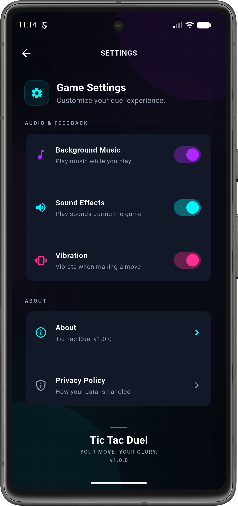
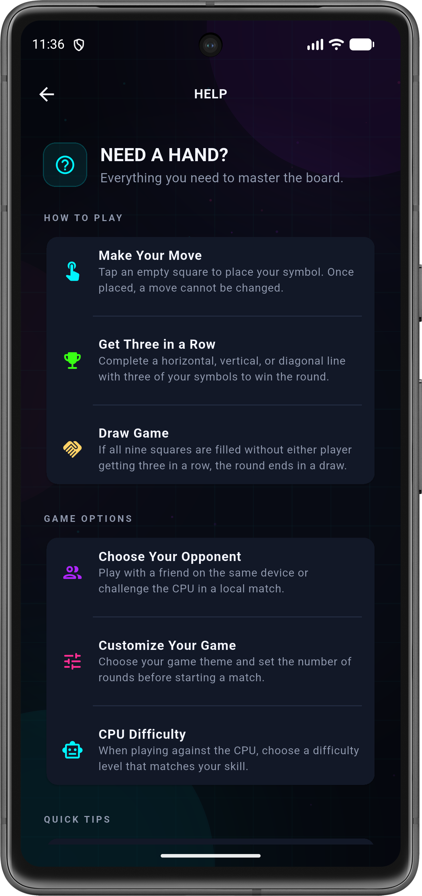
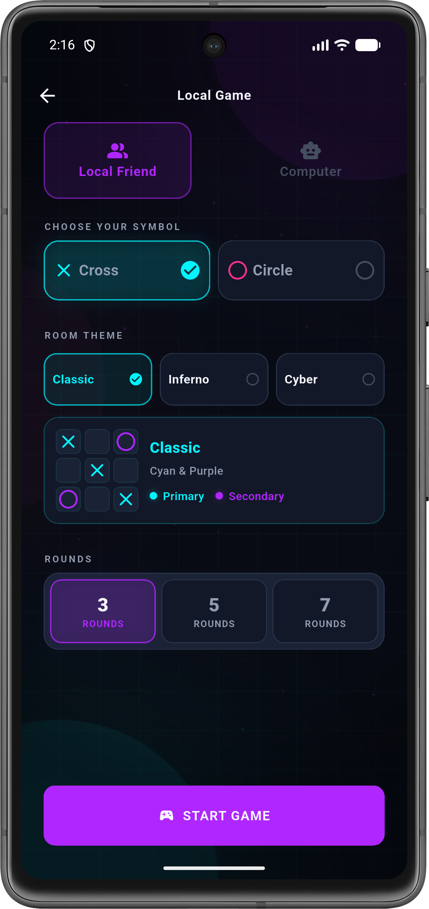
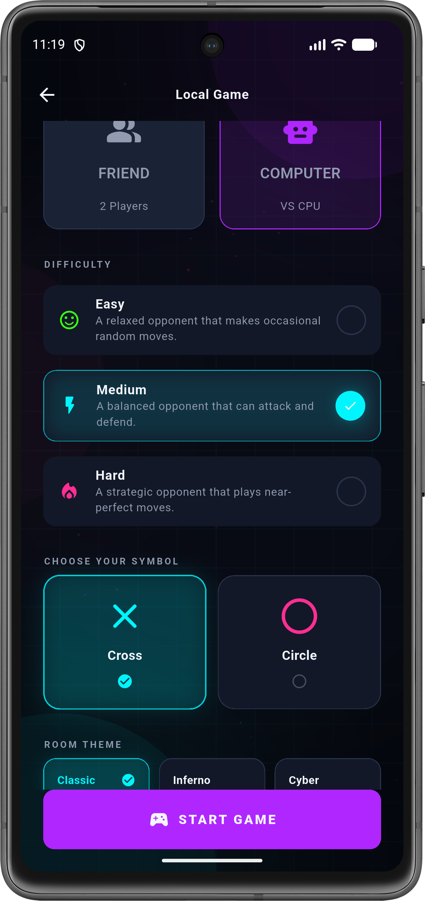
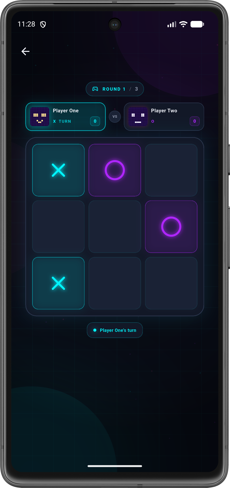
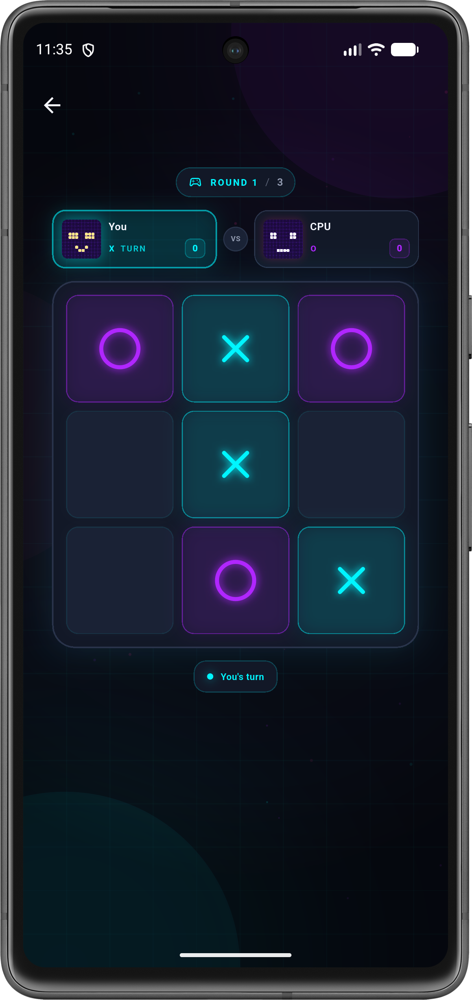
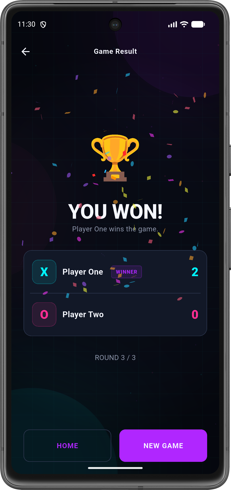
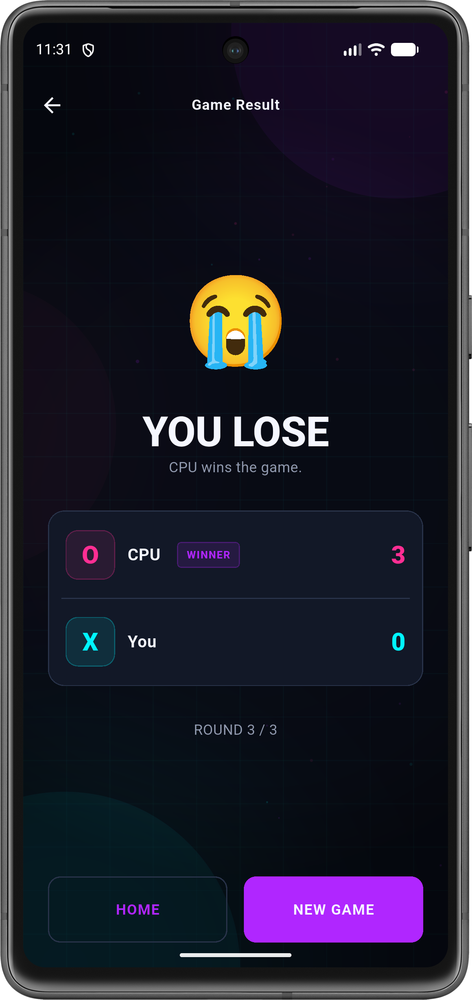
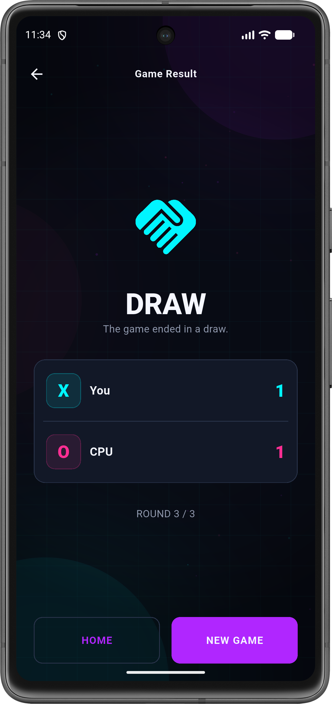

# 🎮 Tic Tac Duel

> A futuristic neon Tic Tac Toe game built with Flutter.

<div style="text-align: center;">
  
</div>

## 📱 About

Tic Tac Duel is a modern Tic Tac Toe experience featuring a futuristic neon interface, local multiplayer gameplay, and CPU challenges.

The game combines classic Tic Tac Toe mechanics with a polished arcade-inspired visual style.

## ✨ Features

* 🎮 Classic Tic Tac Toe gameplay
* 👥 Play against a friend
* 🤖 Challenge the CPU
* ⚡ Multiple CPU difficulty levels
* 🏆 Multi-round gameplay
* 🎨 Multiple visual themes
* 🎵 Background music and sound effects
* ✨ Neon animations and effects
* 📱 Responsive mobile interface
* 🌌 Futuristic cyberpunk-inspired UI

## 🎮 Game Modes

### 👥 Friend Mode

Play Tic Tac Toe against another player on the same device.

### 🤖 CPU Mode

Challenge the CPU with different difficulty levels and test your skills.

## 🎨 Themes

Tic Tac Duel includes multiple neon-inspired themes designed to give each game a distinct visual atmosphere.

* 💜 **Classic**
* 🔥 **Inferno**
* 💚 **Cyber**

## 🕹️ Gameplay

Choose your game mode, configure your match, and take turns placing your symbol on the board.

The objective is simple:

> Get three of your symbols in a row before your opponent does.

Play across multiple rounds and keep track of your progress throughout the match.

## 🛠️ Built With

* **Flutter**
* **Dart**
* **GetX**
* **Flutter Secure Storage**
* **just_audio**
* **Lottie**
* **Flutter Confetti**

## 🚀 Getting Started

### Prerequisites

Make sure Flutter is installed and configured on your system.

Check your Flutter installation:

```bash
flutter doctor
```

### Installation

Clone the repository:

```bash
git clone https://github.com/piro-piyush/TicTac-Duel.git
```

Navigate to the project:

```bash
cd TicTac-Duel
```

Install dependencies:

```bash
flutter pub get
```

## ⚙️ Environment Setup

Tic Tac Duel uses environment variables for app configuration.

Create a `.env` file in the project root:

```env
BASE_URL=YOUR_BASE_URL
```

Replace `YOUR_BASE_URL` with the appropriate URL for your environment.

> **Note:** The `.env` file contains environment-specific configuration and should not be committed to the repository.

Make sure the `.env` file is available before running or building the application.

### Run the Application

```bash
flutter run
```

## 🖼️ Screenshots

<strong>Home</strong><br> 

<strong>Settings</strong><br> 

<strong>Help</strong><br> 

<strong>Friend Mode Setup</strong><br> 

<strong>CPU Mode Setup</strong><br> 

<strong>Friend Game Board</strong><br> 

<strong>CPU Game Board</strong><br> 

<strong>Win Result</strong><br> 

<strong>Lose Result</strong><br> 

<strong>Draw Result</strong><br> 

---
## 📦 Release

### v2.0.0

The **v2.0.0** release introduces the latest Tic Tac Duel gameplay experience, including local multiplayer, CPU gameplay, multiple rounds, themes, and the updated neon interface.

**Version:** `2.0.0+1`

### 📱 Which APK Should I Download?

The Android release includes APKs for different CPU architectures.

| APK                           | Architecture | Recommended For                        |
|-------------------------------|--------------|----------------------------------------|
| `app-arm64-v8a-release.apk`   | ARM64        | Most modern Android phones and tablets |
| `app-armeabi-v7a-release.apk` | ARM32        | Older Android devices                  |
| `app-x86_64-release.apk`      | x86_64       | Android emulators and x86 devices      |

### ⭐ Most Android Phones

Most modern Android phones use **ARM64**.

If you are using a modern Android phone or tablet, download:

```text
app-arm64-v8a-release.apk
```

If you're using an Android emulator, check its configured CPU architecture and download the matching APK.

> **Note:** Install only the APK that matches your device's CPU architecture.

### 📦 Google Play

For Google Play distribution, use the **AAB (`app-release.aab`)**.

Google Play automatically generates optimized APKs for supported devices.

### ⬇️ Download

[Download Tic Tac Duel v2.0.0](https://github.com/piro-piyush/TicTac-Duel/releases/tag/v2.0.0)

## 👨‍💻 Developer

**Piyush Vishwakarma**

Built with Flutter and a passion for creating clean, modern mobile experiences.
