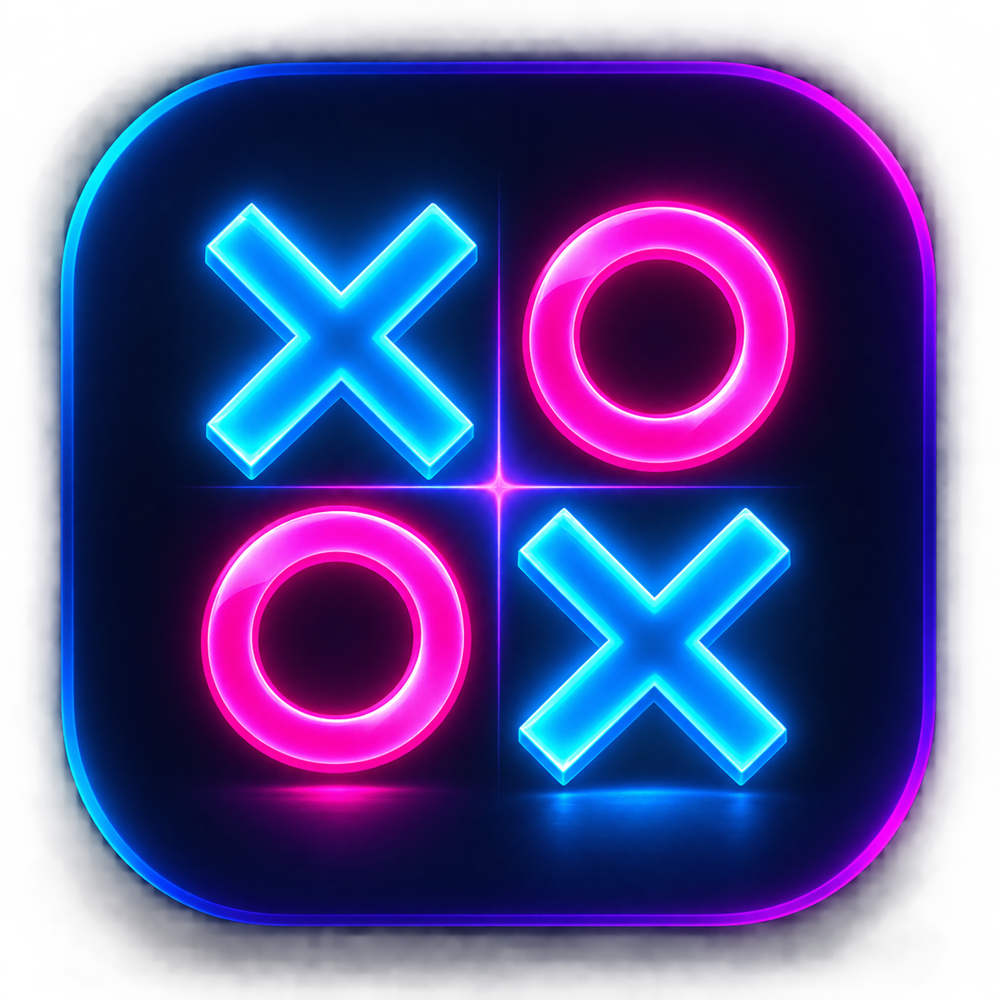

# 🎮 Tic Tac Duel

> A futuristic neon Tic Tac Toe game.

## 📱 App Icon

<p align="center">
  
</p>

## ℹ️ Project Info

Tic Tac Duel is a futuristic neon-themed Tic Tac Toe game built with Flutter, featuring a clean and competitive gameplay experience.

## 🛠️ Tech Stack

* **Flutter** — Cross-platform mobile application
* **Dart** — Application development

## ✨ Features

* 🎮 Local Tic Tac Toe gameplay
* 🤖 Play against the CPU
* 👥 Play with a friend on the same device
* 🌌 Futuristic neon UI
* 🎵 Game audio and sound effects
* 📱 Responsive Flutter interface
* 🏆 Multi-round gameplay
* ⚡ Multiple CPU difficulty levels

## 📂 Project Structure

```text
TicTac-Duel/
└── frontend/       # Flutter application
```

## 🚀 Getting Started

### Frontend

```bash
cd frontend

flutter pub get

flutter run
```

## 📦 Release

### v1.0.0

The first release of Tic Tac Duel.

**Version:** `1.0.0+1`

**Download / Release:**

https://github.com/piro-piyush/tictac-duel/releases/tag/v1.0.0
